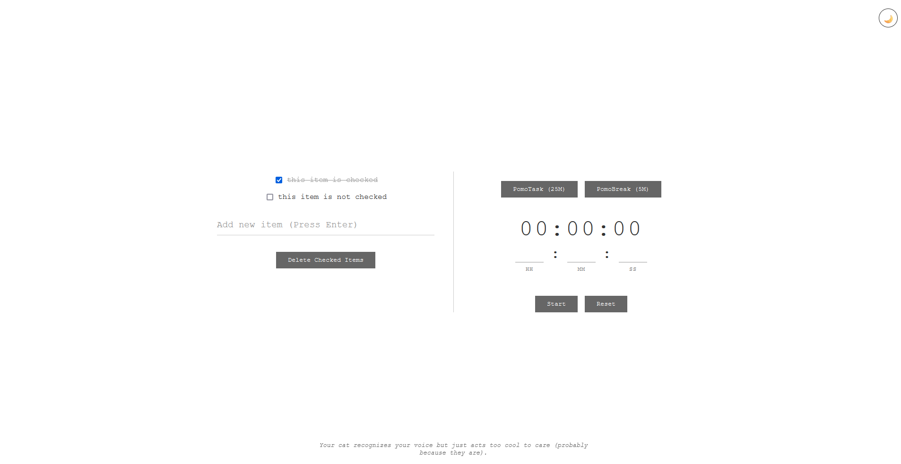

# ProTab - Purrfect Productivity New Tab 🚀


---



Enhance your browser's new tab page with **ProTab** – a feature-rich productivity dashboard combining task management, time tracking, and cat facts.

## ✨ Features

### ProTab v1.0

#### 📌 Interactive Checklist System
- **CRUD Tasks** - Add/remove items with Enter key, persist to `localStorage`
- **Bulk Action** - One-click removal of completed tasks
- **Visual Feedback** - Strike-through animation for checked items

#### ⏲️ Precision Timer with Web Audio
- **Flexible Input** - Set durations in hours/minutes/seconds
- **Audible Alerts** - Web Audio API-powered alarm (configurable oscillator)
- **Notification Support** - Browser notifications + fallback alerts

#### 🎨 Theme Engine
- **Dark/Light Modes** - Toggle with session persistence
- **CSS Variables** - Easy visual customization via `:root` properties

#### 🐾 Feline Productivity Boosters
- **Cat Fact API** - Randomized cat wisdom from [meowfacts.herokuapp.com](https://meowfacts.herokuapp.com/)
- **Purr-sistent Storage** - `localStorage` integration for checklist and theme

#### 🔧 Tech Stack
- Vanilla JavaScript (ES6+)
- Web Audio API for sound notifications
- Modern CSS (Flexbox, Grid, Custom Properties)
- REST API integration

### ProTab v1.1

#### 🍅 Pomodoro Timer
- **Dedicated Modes** - PomoTask (25 minutes) and PomoBreak (5 minutes) presets
- **Automated Start** - One-click activation of Pomodoro cycles
- **Seamless Integration** - Works alongside standard timer functionality

---

## 🛠️ Installation

 🦊 FireFox Users, get the extension here: https://addons.mozilla.org/en-US/firefox/addon/purrfectprotab/

 🌟 Chromium Based Users and Safari Users can download the source code and load the extension temporarily. 

 This extension is submitted for review in Chrome Web Store. 
 Link will be updated here once checks have passed.

---

## 🌐 Browser Support

| Feature               | Chrome      | Firefox     | Safari      |
|-----------------------|-------------|-------------|-------------|
| Web Audio API         | ✔️ 89+      | ✔️ 76+      | ✔️ 14+      |
| Notifications API     | ✔️ 20+      | ✔️ 22+      | ✔️ 16+      |
| CSS Custom Properties | ✔️ 49+      | ✔️ 31+      | ✔️ 9.1+     |

---

## 📜 License

**MIT Licensed**  
Meow freely. 🐈  

---

## 🤝 Contributing

**Claws-ome contributions welcome!** Please:  

1. **Fork** the repository  
2. **Create a feature branch**:  
   ```bash
   git checkout -b feat/amazing-feature