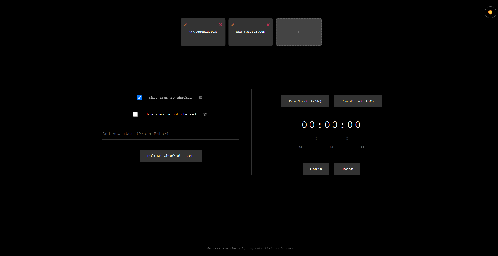

# ProTab - Purrfect Productivity New Tab 🚀



---


Enhance your browser's new tab page with **ProTab** – a feature-rich productivity dashboard combining task management, time tracking, and cat facts.

## ✨ Features

### 📌 Interactive Checklist System
- **CRUD Tasks** - Add/remove items with Enter key, persist to `localStorage`
- **Bulk Action** - One-click removal of completed tasks
- **Visual Feedback** - Strike-through animation for checked items

### ⏲️ Precision Timer with Web Audio
- **Flexible Input** - Set durations in hours/minutes/seconds
- **Audible Alerts** - Web Audio API-powered alarm (configurable oscillator)
- **Notification Support** - Browser notifications + fallback alerts

### 🎨 Theme Engine
- **Dark/Light Modes** - Toggle with session persistence
- **CSS Variables** - Easy visual customization via `:root` properties

### 🐾 Feline Productivity Boosters
- **Cat Fact API** - Randomized cat wisdom from [meowfacts.herokuapp.com](https://meowfacts.herokuapp.com/)
- **Purr-sistent Storage** - `localStorage` integration for checklist and theme

### 🔧 Tech Stack
- Vanilla JavaScript (ES6+)
- Web Audio API for sound notifications
- Modern CSS (Flexbox, Grid, Custom Properties)
- REST API integration

---

## 🛠️ Installation

```bash
# Clone repository
git clone https://github.com/yourusername/protab.git

# Install live server (if needed)
npm install -g live-server

# Run locally
live-server --port=3000
```
---

## 🌐 Browser Support

| Feature               | Chrome      | Firefox     | Safari      |
|-----------------------|-------------|-------------|-------------|
| Web Audio API         | ✔️ 89+      | ✔️ 76+      | ✔️ 14+      |
| Notifications API     | ✔️ 20+      | ✔️ 22+      | ✔️ 16+      |
| CSS Custom Properties | ✔️ 49+      | ✔️ 31+      | ✔️ 9.1+     |

---

## 📜 License

**MIT Licensed**  
Meow freely. 🐈 

---

## 🤝 Contributing

**Claws-ome contributions welcome!** Please:  

1. **Fork** the repository  
2. **Create a feature branch**:  
   ```bash
   git checkout -b feat/amazing-feature