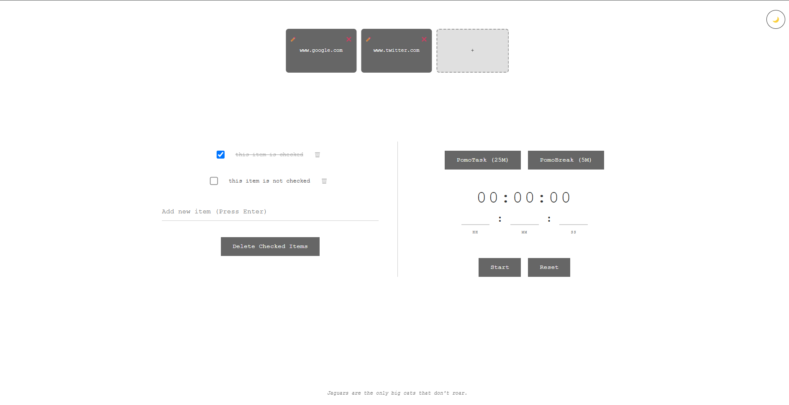

# ProTab - Purrfect Productivity New Tab 🚀


---



Enhance your browser's new tab page with **ProTab** – a feature-rich productivity dashboard combining task management, time tracking, and cat facts.

## ✨ Features

✅ Interactive Checklist: Add, remove, and manage tasks.
🗑️ Bulk Delete: Clear all completed tasks at once.
👀 Visual Cues: Strike-through animation for completed items.
🍅 Pomodoro Timer: Dedicated PomoTask (25 min) and PomoBreak (5 min) modes.
⏱️ Precision Timer: Set durations in hours, minutes, and seconds.
🔊 Audible Alerts: Web Audio API-powered alarm with configurable oscillator.
🔔 Notifications: Browser notifications with fallback alerts.
🌓 Theme Toggle: Switch between dark and light modes.
🎨 Customizable Themes: Easy visual adjustments via CSS variables.
😻 Cat Facts: Random cat wisdom from meowfacts.herokuapp.com.
🐾 Purr-sistent Data: Local storage for checklist and theme settings.

---

## 🛠️ Installation

 🦊 FireFox Users, get the extension here: https://addons.mozilla.org/en-US/firefox/addon/purrfectprotab/

 🌟 Chromium Based Users and Safari Users can download the source code and load the extension temporarily. 

 This extension is submitted for review in Chrome Web Store. 
 Link will be updated here once checks have passed.

---

## 🌐 Browser Support

| Feature               | Chrome      | Firefox     | Safari      |
|-----------------------|-------------|-------------|-------------|
| Web Audio API         | ✔️ 89+      | ✔️ 76+      | ✔️ 14+      |
| Notifications API     | ✔️ 20+      | ✔️ 22+      | ✔️ 16+      |
| CSS Custom Properties | ✔️ 49+      | ✔️ 31+      | ✔️ 9.1+     |

---

## 📜 License

**MIT Licensed**  
Meow freely. 🐈 

---

## 🤝 Contributing

**Claws-ome contributions welcome!** Please:  

1. **Fork** the repository  
2. **Create a feature branch**:  
   ```bash
   git checkout -b feat/amazing-feature